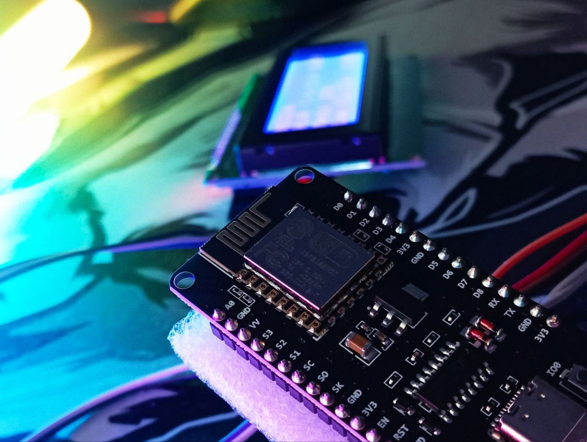
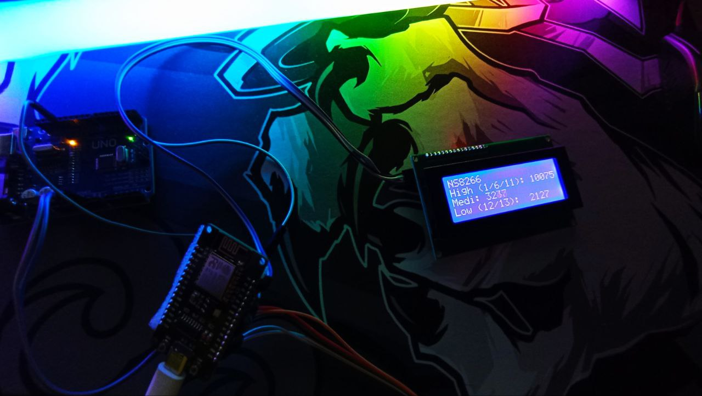

# NS8266 - Network Scan ESP8266 📡

**NS8266** — это проект для мониторинга и анализа активности Wi-Fi сетей с использованием микроконтроллера **ESP8266**.
Этот инструмент позволяет сканировать Wi-Fi каналы, анализировать их загруженность и визуализировать данные для дальнейшего использования.

 

---

## Презентация Проекта 🎥

Хотите узнать больше о проекте **NS8266**? Посмотрите презентацию:  
👉 [Презентация NS8266](https://view.genially.com/67b60c2da3fee948bc347cbc/presentation-ns8266)

---

## Описание Проекта 📊

**NS8266** разработан для:
- **Мониторинга загруженности Wi-Fi каналов** в диапазоне 2.4 ГГц.
- **Категоризации активности каналов** на три группы: высокая, средняя и низкая загруженность.
- **Визуализации данных** в реальном времени на LCD-дисплее.
- **Логирования данных** на SD-карту для последующего анализа.

Проект особенно полезен для:
- Оптимизации выбора Wi-Fi каналов в зонах с высокой конкуренцией.
- Отладки и анализа работы Wi-Fi сетей.
- Обучения основам работы с пакетами Wi-Fi и анализом сетевого трафика.

---

## Возможности ✨

### 1. Сканирование Wi-Fi Каналов
- Использует режим **Promiscuous Mode** для захвата всех пакетов в радиусе действия.
- Анализирует RSSI (уровень сигнала) и другие параметры пакетов.
- Автоматически переключается между каналами для полного покрытия диапазона 2.4 ГГц.

### 2. Категоризация Каналов
- **Высокая загруженность**: Каналы 1, 6 и 11 (наиболее часто используемые).
- **Средняя загруженность**: Каналы 2-5 и 7-10.
- **Низкая загруженность**: Каналы 12-14 (менее популярные).

### 3. Реальное Время
- Данные отображаются на **LCD-экране** в реальном времени.
- Логируются на **SD-карту** для последующего анализа.

### 4. Визуализация Данных
- Python-скрипт (`vizual.py`) считывает логи с SD-карты и строит графики для анализа трендов активности каналов.

---

## Требования к Аппаратному Обеспечению 💻

1. **ESP8266**:
   - Поддерживаемые платы: NodeMCU, Wemos D1 Mini или аналогичные.
2. **LCD-Дисплей**:
   - I2C-совместимый дисплей размером 20x4.
3. **SD-Карта**:
   - Модуль для чтения/записи SD-карт через SPI.
4. **Подключение**:
   - Подключите LCD и SD-модуль согласно указаниям в коде.

---

## Требования к Программному Обеспечению 🛠️

### Для ESP8266:
1. **Arduino IDE**:
   - Установите Arduino IDE и настройте его для работы с ESP8266.
   - Необходимые библиотеки:
     - `LiquidCrystal_I2C`
     - `Ticker`
     - `SD`
     - `SPI`
     - `Wire`

### Для Визуализации:
1. **Python 3.x**:
   - Установите Python 3.x на ваш компьютер.
   - Необходимые библиотеки:
     - `matplotlib`
     - `tkinter`

---

## Использование 🚀

### Шаг 1: Настройка ESP8266
1. Загрузите файл `NS8266.ino` в Arduino IDE.
2. Подключите LCD и SD-модуль к ESP8266.
3. Загрузите прошивку на ESP8266.
4. Убедитесь, что устройство начинает сканирование каналов.

### Шаг 2: Мониторинг Активности
- Наблюдайте за данными на LCD-экране.
- Проверьте логи на SD-карте (`log.txt`).

### Шаг 3: Визуализация Данных
1. Запустите скрипт `vizual.py` на вашем компьютере.
2. Выберите файл `log.txt` из SD-карты.
3. Посмотрите графики активности каналов.

---

## Пример Работы 📋

### LCD-Экран
 

```bash
NS8266
High (1/6/11): 10075
Medi: 3237
Low (12/13): 2127
```

### График Визуализации
- **Красная линия**: Высокая загруженность (каналы 1, 6, 11).
- **Оранжевая линия**: Средняя загруженность (каналы 2-5, 7-10).
- **Жёлтая линия**: Низкая загруженность (каналы 12-14).

---

## Установка и Запуск 📥
1. Клонируйте репозиторий:
```bash
git clone https://github.com/Pasha33Pro/ESP8266.git
```
2. Загрузите прошивку на ESP8266
3. Проведите мониторинг активности
4. Извлеките SD карту и покдлючите к вашему устройству (ПК / Ноутбук)
5. Запустите `vizual.py` или `vizual.exe`
6. Следуйте инструкциям


## 👨‍💻 Автор

- Разработчик: Иванов П.В. (Pasha33Pro)
- Проекты разработаны в рамках обучения

## 📄 Лицензия

Проекты распространяются под лицензией MIT. Подробности в файле [LICENSE](LICENSE).

---

## Благодарности 🙏
- Сообществу ESP8266 за отличную документацию
- Авторам библиотек LiquidCrystal_I2C и matplotlib
